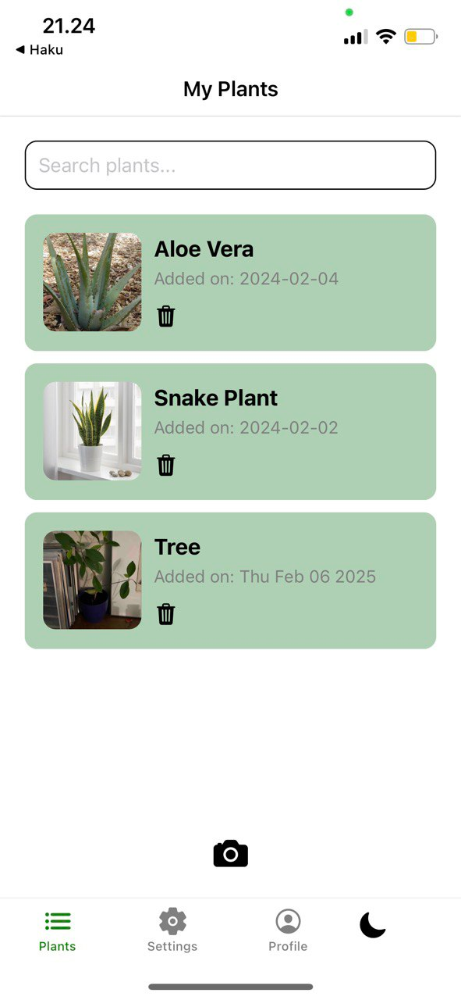
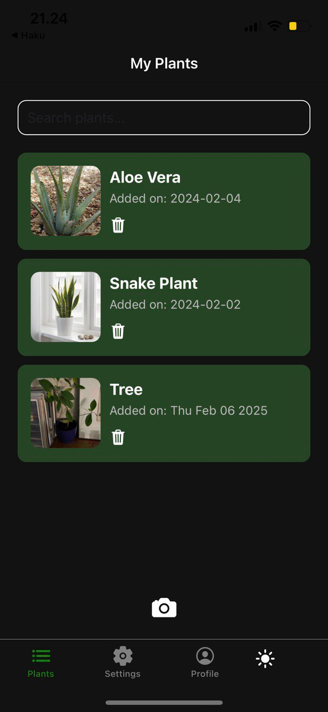
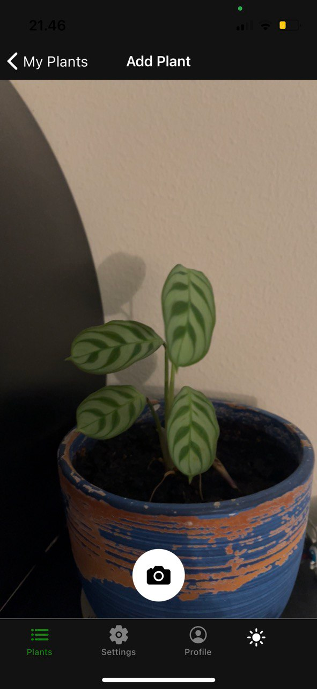
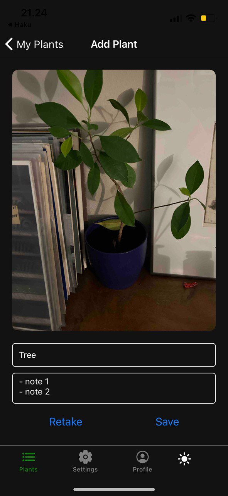
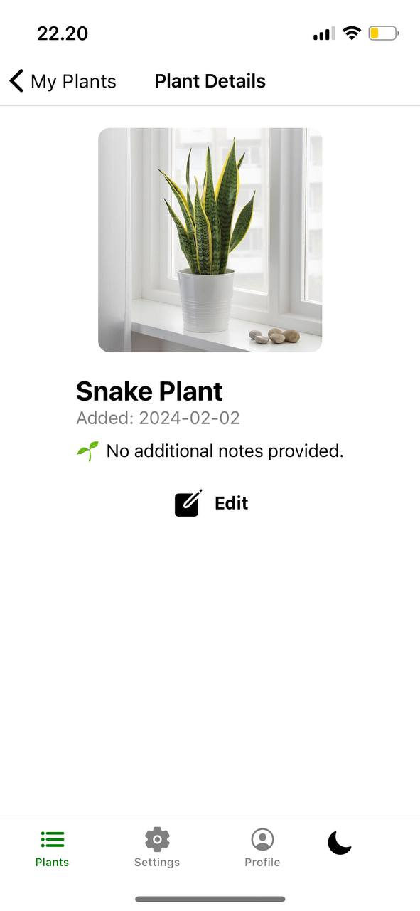
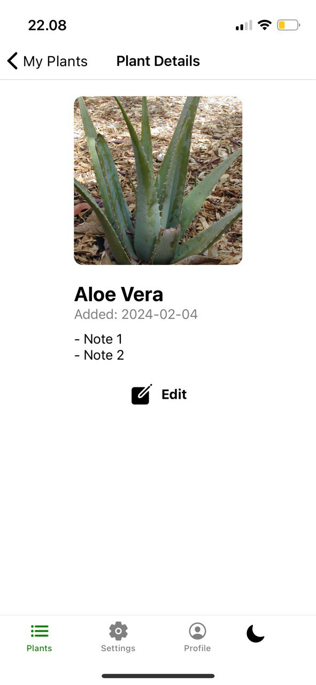
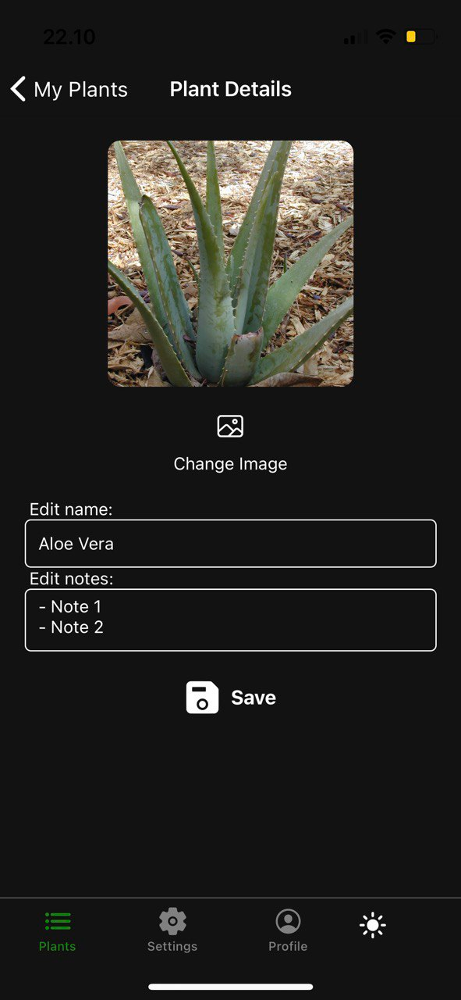

# Plant App

A React Native application for a plant database. Hosted at https://plant-app.d2clbqnc5vnwxl.amplifyapp.com/

## Screenshots

### List View



### Scan View



### Detail View



## Instructions to Run the App

### Steps to Run the App

1. Clone the repository:
   ```sh
   git clone https://github.com/Lindrax/plant-app.git
   cd plant-app
   ```
2. Install dependencies:
   ```sh
   npm install
   ```
3. Start the development server:
   ```sh
   npm start
   ```
4. Scan the QR code with the Expo Go app on your mobile device, run it in an emulator or access the web interface in http://localhost:8081

## Architecture and Technical Decisions

### Architecture

The app follows a component-based architecture using React Native with Expo for easy development and deployment. It is structured into several key components:

- **Context API**: Manages global states for plants and themes, ensuring consistent data and theme management across the app.
- **Navigation**: Uses `react-navigation` to handle both tab-based and stack-based navigation. The file structure mirrors the navigation structure for improved readability and maintainability.
- **Screens**:
  - **List Screen**: Displays a list of stored plants with options to filter, delete, and view plant details. Clicking on a plant navigates to the detail view.
    - **Scan Screen**: Allows users to capture and add a new plant using the camera or gallery.
    - **Plant Detail View**: Displays detailed information about a plant, including options to edit its name, notes, and image.
  - **Settings Screen**: Includes options for toggling between dark and light modes, and placeholders for additional settings like notifications.
  - **Profile Screen**: Displays user profile information, including placeholders and basic statistics like the total number of plants.
- **Theme Support**: Implements a dark/light theme using AsyncStorage and React Context. The theme is applied uniformly across the app, and changes are reflected instantly.
- **LocalStorage for Plants**: The app uses `localStorage` to persist the list of plants, ensuring that the data is retained across app reloads.

### Technical Decisions

- **Expo for development**: Simplifies app setup, camera integration, and cross-platform compatibility.
- **Context API for state management**: Lightweight and efficient for managing global states like plants and themes.
- **React Navigation**: Provides a clean, scalable, and flexible navigation system for both tab and stack navigation.
- **AsyncStorage for theme persistence**: Ensures user preferences (e.g., dark/light mode) are saved across sessions, providing a seamless user experience.
- **LocalStorage for plant persistence**: Ensures that the plant data is saved locally, allowing users to retain their plant list even after closing the app.
